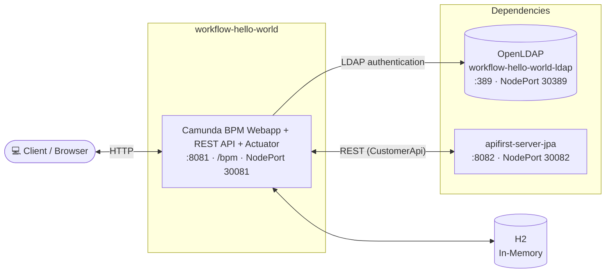
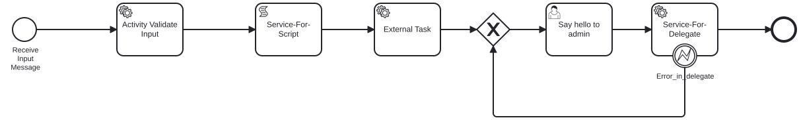

# Camunda BPM Hello World

Camunda BPM **7.24** Hello World application (Java 25): a Spring Boot app that embeds the Camunda BPM
engine. Under the context path `/bpm` it serves the Camunda webapp, a REST API and the actuator
endpoints, authenticates users against LDAP (local OpenLDAP or Active Directory), calls the
downstream `apifirst-server-jpa` service from the BPMN process, and is deployed to Kubernetes with
Helm.

## Architecture Overview



## BPMN Process

The executable process definition `hello-world-process` ("Hello World Process") is embedded in the
application: [`src/main/resources/process.bpmn`](src/main/resources/process.bpmn). The rendered
diagram is exported with [bpmn.io](https://bpmn.io) to
[`docs/process-diagram.svg`](docs/process-diagram.svg); open the `.bpmn`
in the [Camunda Modeler](https://camunda.com/download/modeler/) to view or edit it. At runtime the
diagram is also shown in the Camunda webapp (Cockpit).



Flow: `Receive Input Message` → `Activity Validate Input` → `Service-For-Script` → `External Task`
(topic `sayHelloTopic`) → `Say hello to admin` (user task) → `Service-For-Delegate` → end, with a
boundary error event attached to the delegate.

## Prerequisites

|   Requirement   |                   Version / Note                    |
|-----------------|-----------------------------------------------------|
| Java            | 25                                                  |
| Maven Wrapper   | included (`./mvnw`)                                 |
| Camunda BPM     | 7.24 (embedded, `camunda-bpm-spring-boot-starter`)  |
| Spring Boot     | 3.5.16                                              |
| Docker          | for `compose.yaml` (OpenLDAP + apifirst-server-jpa) |
| Kubernetes/Helm | optional (deployment)                               |

The `local` profile uses `compose.yaml`; Spring Boot Docker Compose starts the services
automatically when the app boots.

## Profiles

|         Profile          |    Database    |       LDAP       |                Notes                |
|--------------------------|----------------|------------------|-------------------------------------|
| `local`                  | H2 (in-memory) | local OpenLDAP   | default; Docker Compose auto-start  |
| `local_active_directory` | H2 (in-memory) | Active Directory | requires `src/main/conf/local.conf` |
| `ci`                     | PostgreSQL     | LDAP             | requires `src/main/conf/ci.conf`    |
| `ci_active_directory`    | PostgreSQL     | Active Directory | requires `src/main/conf/ci.conf`    |

The run configurations in `.run/` read their secrets from `src/main/conf/`: rename
`changeme-local.conf` to `local.conf` and `changeme-ci.conf` to `ci.conf`, then fill in the passwords
(`local.conf` needs `ldap.password`; `ci.conf` needs `camunda.db.password` and `ldap.password`).

## Build & Test

```bash
./mvnw clean verify          # full build: format check, unit + integration tests, Helm lint/template
./mvnw clean install         # verify + build local Docker image + package Helm chart
./mvnw test                  # unit tests only (*Test)
./mvnw test -Dtest=ActuatorInfoTest              # single test class
./mvnw test -Dtest=ActuatorInfoTest#methodName   # single test method
./mvnw spring-boot:run       # start locally on port 8081 (context path /bpm)
./mvnw spotless:apply        # auto-fix pom/markdown/json/yaml/shell formatting
./mvnw spring-javaformat:apply                   # auto-fix Java code style
```

> Formatting is enforced at build time. Run both `spotless:apply` and `spring-javaformat:apply`
> before committing if the build fails at the `validate` phase.

## Sandbox (local dev environment)

The sandbox is provisioned by the opencode-sandbox-kit and runs as a Docker container. It mounts this
repo, starts the agent, and connects the IntelliJ MCP server.

Allow the kit source (GitHub without cloning):

```powershell
sbx settings set kit.allowedSources --% "[\"docker.io/\",\"github.com/dboeckli/\"]"
```

Start a new sandbox:

```powershell
sbx run opencode `
    --kit "git+https://github.com/dboeckli/opencode-sandbox-kit.git#dir=opencode-agent" `
    --template docker/sandbox-templates:opencode-docker-0.5.0 `
    --no-share-skills `
    --static-mcp idea `
    . `
    "C:\development\maven-repo:ro"
```

Start the sandbox with Kubernetes support:

```powershell
sbx run opencode `
    --kit "git+https://github.com/dboeckli/opencode-sandbox-kit.git#dir=opencode-agent" `
    --template docker/sandbox-templates:opencode-docker-0.5.0 `
    --no-share-skills `
    --static-mcp idea `
    . `
    "C:\development\maven-repo:ro" `
    "$env:USERPROFILE\.kube:ro"
```

Claude variant (Home):

```powershell
sbx run claude `
    --kit "git+https://github.com/dboeckli/opencode-sandbox-kit.git#dir=opencode-agent" `
    --template docker/sandbox-templates:claude-code-docker-0.5.0 `
    --no-share-skills `
    --static-mcp idea `
    . `
    "C:\development\maven-repo:ro"
```

Mammouth (template pin lives in the spec image):

```powershell
sbx run "git+https://github.com/dboeckli/opencode-sandbox-kit.git#dir=mammouth-agent" `
    --no-share-skills `
    --static-mcp idea `
    . `
    "C:\development\maven-repo:ro"
```

Apply the kit to an existing sandbox (restarts the sandbox, VM state is kept):

```powershell
sbx kit add <sandbox-name> "git+https://github.com/dboeckli/opencode-sandbox-kit.git#dir=opencode-agent"
```

> **Sandbox quirk:** Before any `./mvnw` in the sandbox run `export npm_config_bin_links=false`
> (Spotless/prettier otherwise fails with EPERM on the mounted workspace).

## Running Locally

Start the application with `./mvnw spring-boot:run` or the `Application` run configuration in
IntelliJ (profile `local`, main class `ch.bpm.workflow.example.Application`). Spring Boot Docker
Compose auto-starts `compose.yaml` (OpenLDAP + apifirst-server-jpa) on startup.

### Endpoints

|    Resource    |                      Local                      |               Kubernetes (NodePort)                |
|----------------|-------------------------------------------------|----------------------------------------------------|
| Camunda Webapp | http://localhost:8081/bpm/camunda/app/welcome   | http://\<node-ip\>:30081/bpm/camunda/app/welcome   |
| REST API       | http://localhost:8081/bpm/restapi               | http://\<node-ip\>:30081/bpm/restapi               |
| Actuator       | http://localhost:8081/bpm/actuator              | http://\<node-ip\>:30081/bpm/actuator              |
| Swagger UI     | http://localhost:8081/bpm/swagger-ui/index.html | http://\<node-ip\>:30081/bpm/swagger-ui/index.html |
| OpenAPI JSON   | http://localhost:8081/bpm/swagger/v3/api-docs   | http://\<node-ip\>:30081/bpm/swagger/v3/api-docs   |
| H2 Console     | http://localhost:8081/bpm/h2-console            | http://\<node-ip\>:30081/bpm/h2-console            |

H2 connection URL for the console: `jdbc:h2:mem:workflow-hello-world`.

The REST API exposes `ping`, `camunda` and `workflow` resources, e.g.:

- http://localhost:8081/bpm/restapi/ping
- http://localhost:8081/bpm/restapi/camunda
- http://localhost:8081/bpm/restapi/workflow

### IntelliJ HTTP Client

The `httprequest/` folder contains IntelliJ HTTP request files for manual testing:

|      File       |                Coverage                |
|-----------------|----------------------------------------|
| `rest.http`     | REST API (`ping`/`camunda`/`workflow`) |
| `camunda.http`  | Camunda engine REST API                |
| `actuator.http` | Actuator/health endpoints              |
| `apifirst.http` | apifirst-server-jpa endpoints          |

Requests include W3C trace context via `httprequest/scripts/traceparent.js` (`traceparent` and
`baggage: testBaggage=workflow-hello-world` headers) so the tracing setup can be exercised manually.
Environments (`host`, `context`, credentials) are configured in `httprequest/http-client.env.json`.

## Kubernetes (Helm)

Deployment is Helm-only and goes into the **`workflow-hello-world`** namespace.

After `./mvnw clean install`, the packaged charts are placed in `target/helm/repo/`
(`workflow-hello-world-chart-*.tgz` and the local subchart `workflow-hello-world-ldap-*.tgz`).

```powershell
cd target/helm/repo

$file = Get-ChildItem -Filter workflow-hello-world-chart-*.tgz | Select-Object -First 1
tar -xvf $file.Name

helm upgrade --install workflow-hello-world ./workflow-hello-world-chart `
  --namespace workflow-hello-world --create-namespace `
  --wait --timeout 8m --debug --render-subchart-notes
```

> The release name must be `workflow-hello-world` (not the chart directory name), otherwise the
> `wait-for-ldap` init container cannot resolve the LDAP service name.

### Helm Operations

```powershell
# List pods
kubectl get pods -n workflow-hello-world

# Logs (replace $POD with a pod name from the command above)
kubectl logs $POD -n workflow-hello-world --all-containers

# Describe a pod (e.g. workflow-hello-world, workflow-hello-world-workflow-hello-world-ldap,
# workflow-hello-world-apifirst-server-jpa)
kubectl describe pod $POD_NAME -n workflow-hello-world

# Show endpoints
kubectl get endpoints -n workflow-hello-world

# Helm status / test / uninstall
helm status workflow-hello-world --namespace workflow-hello-world
helm test   workflow-hello-world --namespace workflow-hello-world --logs
helm uninstall workflow-hello-world --namespace workflow-hello-world

# Remove all resources in the namespace
kubectl delete all --all -n workflow-hello-world
```

### Debugging in Kubernetes

Spawn a temporary BusyBox shell for in-cluster diagnostics:

```powershell
kubectl run busybox-test --rm -it `
  --image=busybox:1.38.0 `
  --namespace=workflow-hello-world `
  --command -- sh
```

Use the actuator endpoint to verify the application is healthy via NodePort **30081**.
